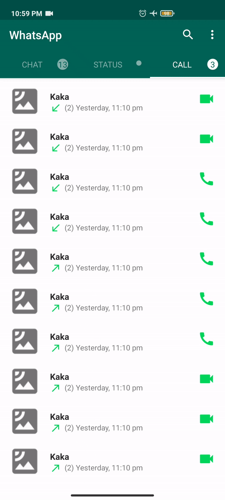

# WhatAppUI-Replica

I gave myself a challenge to build WhatsApp mobile main Screen UI replica without referring to any of the youtube videos,      
And I must say that it was fun.      
You cannot install this app, But can reffer to the code. Below it the Priview of the app    

#### NOTE : I am using ViewPager2, Fragments, Co-ordniator layout for displaying Chat,Status and Call Fragment, and for [circular image](https://github.com/hdodenhof/CircleImageView) 
### Chat Screen
    

Custom Search View has its own Feature like click on the type of file we want and search view will indicate which type of file it is searching.         
Chat Fragment will Scroll to top whenever you enter in it.            
This is implemented in [ChatFragment.java](https://github.com/DonutsDevil/WhatAppUI-Replica/blob/main/Source%20Code/Java%20Main/ChatFragment.java), 
[ChatFragmentAdapter.java](https://github.com/DonutsDevil/WhatAppUI-Replica/tree/main/Source%20Code/Java%20Main/Adapters) here Adapter is used to populate dummy data.       
When clicked on ***search menu*** we display [Custom Search View](https://github.com/DonutsDevil/WhatAppUI-Replica/blob/main/Source%20Code/res/layout-v23/search_action_bar_layout.xml) 

### Status Screen
 

Here we use the same [Custom Search View](https://github.com/DonutsDevil/WhatAppUI-Replica/blob/main/Source%20Code/res/layout-v23/search_action_bar_layout.xml) but here bottom **ICON SEARCH**  is disable        
Status Fragment will Scroll to top whenever you enter in it.

This is implemented in [StatusFragment.java](https://github.com/DonutsDevil/WhatAppUI-Replica/blob/main/Source%20Code/Java%20Main/StatusFragment.java), 
[StatusFragmentAdapter.java](https://github.com/DonutsDevil/WhatAppUI-Replica/blob/main/Source%20Code/Java%20Main/Adapters/StatusFragmentAdapter.java)here Adapter is used to populate dummy data.

### Chat Screen
 

Here we use the same [Custom Search View](https://github.com/DonutsDevil/WhatAppUI-Replica/blob/main/Source%20Code/res/layout-v23/search_action_bar_layout.xml) but here bottom **ICON SEARCH**  is disable        
Status Fragment will Scroll to top whenever you enter in it.

This is implemented in [CallFragment.java](https://github.com/DonutsDevil/WhatAppUI-Replica/blob/main/Source%20Code/Java%20Main/CallFragment.java), 
[CallFragment.java.java](https://github.com/DonutsDevil/WhatAppUI-Replica/blob/main/Source%20Code/Java%20Main/Adapters/CallFragmentAdapter.java)here Adapter is used to populate dummy data.

#### LAST POINT

[MainActivity.java](https://github.com/DonutsDevil/WhatAppUI-Replica/blob/main/Source%20Code/Java%20Main/MainActivity.java) This is the Entry point of application.    
And you will also notice that I have used ***NestedScrollView*** in each ***Fragments XML*** instead of using it in [activity_main.xml](https://github.com/DonutsDevil/WhatAppUI-Replica/blob/main/Source%20Code/res/layout/activity_main.xml)      
Cause Doing so will solve the issue of ViewPager2 having height as of the *First Fragment* in our case its *ChatFragment*  
